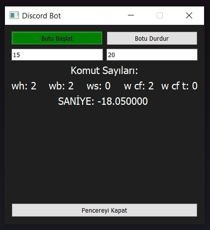
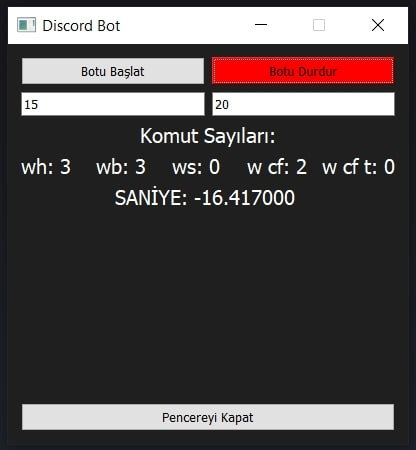

# RandomCommandBot
Discord Bot Manager  

# Discord Bot GUI Uygulaması

Bu proje, PyQt5 kütüphanesini kullanarak Discord botunuza otomatik mesaj gönderen bir grafiksel kullanıcı arayüzü (GUI) uygulamasıdır. Uygulama, Discord API'sini kullanarak Discord sunucusuna mesaj gönderir.




## Gereksinimler

- Python 3.x
- PyQt5
- requests

## Kurulum

1. İlk olarak, Python 3.x sürümünü [Python web sitesinden](https://www.python.org/downloads/) indirin ve sisteminize kurun.

2. Terminali açın ve aşağıdaki komutu çalıştırarak `requests` kütüphanesini yükleyin:

   ```shell
   pip install requests

3. PyQt5 kütüphanesini yüklemek için aşağıdaki komutu çalıştırın:

   pip install pyqt5

4. Projeyi GitHub'dan indirin veya klonlayın:

   git clone https://github.com/kullanici_adi/proje_adi.git

Not: "kullanici_adi" ve "proje_adi"'nı kendi GitHub hesabınıza ve proje adınıza göre değiştirin.

## Kullanım

1. Terminalde proje klasörüne gidin:
  
   cd proje_adi

Not: "proje_adi" klasör adınızla değiştirin.

4. "bot.py" dosyasını bir metin düzenleyicisiyle açın ve aşağıdaki değişiklikleri yapın:
  
   "YOUR_AUTHORIZATION_TOKEN": Kendi Discord botunuzun yetkilendirme anahtarını buraya yapıştırın.

   "DISCORD_API_URL": Discord API URL'sini buraya yapıştırın.

Not: Discord botunuzu nasıl oluşturacağınız ve yetkilendirme anahtarını 
nasıl alacağınız hakkında bilgi almak için Discord API belgelerini kontrol edin. 

3. Terminalde aşağıdaki komutu çalıştırarak uygulamayı başlatın:

   python bot.py

4. Uygulama başladığında, GUI penceresi görüntülenecektir. "Start BOT" düğmesine tıklayarak Discord botunu başlatabilirsiniz. "Rastgele Başlangıç" ve "Rastgele Son" alanlarına istediğiniz başlangıç ve bitiş sürelerini girerek botun rastgele bir süre aralığında mesaj göndermesini sağlayabilirsiniz.

5. "Stop BOT" düğmesine tıklayarak botu durdurabilirsiniz.

6. "Pencereyi Kapat" düğmesine tıkladığınızda, pencerenin otomatik olarak kapatılması için 5 saniyelik bir geri sayım başlayacaktır.

## Katkılar
    Katkıda bulunmak için lütfen CONTRIBUTING.md dosyasını okuyun ve nasıl katkıda bulunabileceğinizi öğrenin.


